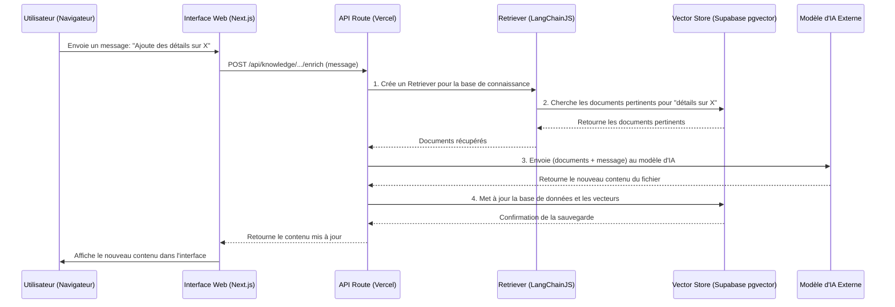
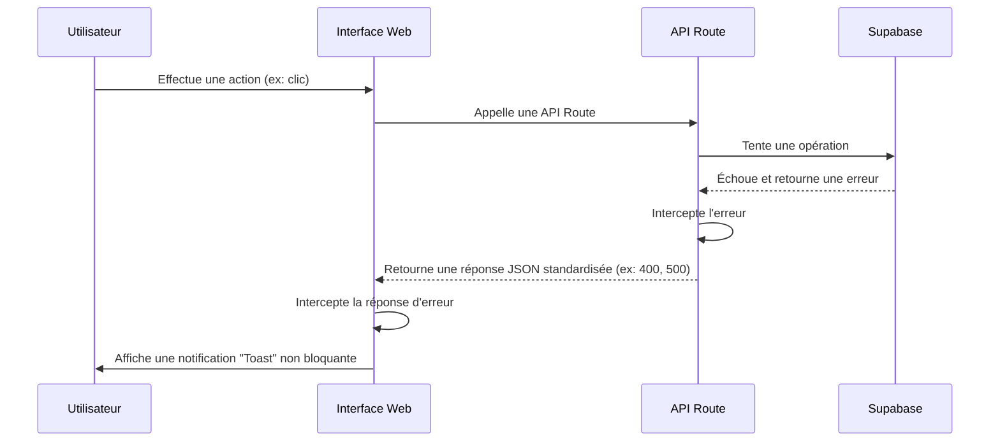

# Architecture Fullstack - Ingénierie Contextuelle

# 1. Introduction

Ce document décrit l'architecture fullstack complète pour le projet d'ingénierie contextuelle, incluant les systèmes back-end, l'implémentation front-end, et leur intégration. Il sert de source de vérité unique pour le développement, garantissant la cohérence à travers toute la stack technologique.

## Starter Template ou Projet Existant

N/A - Il s'agit d'un projet Greenfield.

---

# 2. Architecture de Haut Niveau

## Résumé Technique

L'architecture est conçue comme une application web moderne, serverless, et hébergée sur Vercel. Elle utilise un monorepo contenant une application front-end Next.js (React/TypeScript) et une logique back-end implémentée via les API Routes de Next.js. L'authentification et la base de données sont gérées par **Supabase**, offrant une solution BaaS (Backend as a Service) robuste et intégrée. Les interactions avec l'IA seront structurées via **LangChainJS** pour garantir des réponses contextuellement pertinentes.

## Plateforme et Infrastructure

- **Plateforme :** Vercel (pour le front-end et les fonctions serverless), Supabase (pour le back-end de données).
- **Services Clés :** Vercel Functions (pour la logique métier), Vercel Edge Network (pour le front-end), **Supabase Postgres avec `pgvector`** (pour la base de données et le Vector Store), **Supabase Auth** (pour l'authentification), **Supabase Storage** (pour le stockage de fichiers).
- **Régions de Déploiement :** Global (via le Edge Network de Vercel).

## Structure du Dépôt

- **Structure :** Monorepo
- **Outil :** npm Workspaces (natif et simple pour démarrer).

## Diagramme d'Architecture de Haut Niveau

```mermaid
graph TD
    subgraph "Utilisateur (Navigateur)"
        A[Interface Web Next.js]
    end

    subgraph "Infrastructure"
        B[API Routes Next.js (Vercel)]
        subgraph "Supabase"
            C[Base de Données (Postgres)]
            G[Authentification]
        end
    end

    subgraph "Services Externes"
        E[API GitHub/VCS]
        F[Modèles IA (ex: OpenAI/Google)]
    end

    A -- "Appels API" --> B;
    A -- "Auth" --> G;
    B -- "Accès Données" --> C;
    B -- "Analyse de code" --> E;
    B -- "Génération de tâches" --> F;
```

## Patrons d'Architecture

- **Architecture Serverless :** Toute la logique back-end s'exécute dans des fonctions à la demande, éliminant la gestion de serveurs.
- **Backend as a Service (BaaS) :** Utilisation de Supabase pour déléguer la gestion de la base de données et de l'authentification.
- **Retrieval Augmented Generation (RAG) :** Utilisation de LangChainJS pour créer des chaînes qui récupèrent du contexte avant d'interroger le modèle d'IA.
- **Monorepo :** Le code front-end, back-end et partagé coexistent dans un seul dépôt pour une meilleure cohérence.

---

# 3. Stack Technique

| Catégorie            | Technologie             | Version    | Objectif                                  | Rationale                                                                              |
| -------------------- | ----------------------- | ---------- | ----------------------------------------- | -------------------------------------------------------------------------------------- |
| Langage              | TypeScript              | ~5.4       | Langage principal                         | Typage statique pour la robustesse et la maintenabilité.                               |
| Framework Front-end  | Next.js (React)         | ~14.2      | Interface utilisateur et back-end         | Framework intégré, performances optimales, écosystème riche.                           |
| Style                | Tailwind CSS            | ~3.4       | Style de l'interface                      | Approche "utility-first" pour un développement rapide et un design personnalisé.       |
| Bibliothèque UI      | Shadcn/UI               | ~0.8       | Composants de base                        | Bibliothèque de composants accessibles et personnalisables, basée sur Tailwind.        |
| Gestion de l'État    | Zustand                 | ~4.5       | Gestion de l'état global du client        | Léger, simple et performant. Évite les re-renders inutiles de React Context.           |
| **Orchestration IA** | **LangChainJS**         | **Latest** | **Structurer les interactions avec l'IA** | **Fournit des patrons robustes (Retrieval Chains) pour créer des IA contextuelles.**   |
| Base de Données      | **Supabase (Postgres)** | N/A        | Stockage persistant de la connaissance    | Solution BaaS complète avec une base de données SQL robuste et des API auto-générées.  |
| Déploiement          | Vercel                  | N/A        | Hébergement et CI/CD                      | Plateforme optimisée pour Next.js, déploiement continu intégré.                        |
| Authentification     | **Supabase Auth**       | N/A        | Gestion des utilisateurs                  | Solution intégrée à la base de données, gère l'OAuth avec GitHub de manière sécurisée. |
| Tests                | Jest & Playwright       | Latest     | Tests unitaires, intégration, E2E         | Outils standards pour une pyramide de tests complète.                                  |
| Icônes               | Heroicons               | ~2.1       | Iconographie de l'interface               | Bibliothèque d'icônes de haute qualité, conçue pour Tailwind CSS.                      |

---

# 4. Modèles de Données

## User

- **Objectif :** Représente un utilisateur de l'application (géré par Supabase Auth).
- **Attributs :** `id`, `name`, `email`, `image`.

## Workspace (Repo)

- **Objectif :** Représente un dépôt Git connecté et analysé.
- **Attributs :** `id`, `name`, `url`, `ownerId` (relation vers User), `knowledgeBaseId`.

## KnowledgeBase

- **Objectif :** Contient la structure et le contenu de la documentation générée.
- **Attributs :** `id`, `structure` (JSON), `files` (relation vers KnowledgeFile).

## KnowledgeFile

- **Objectif :** Représente un fichier `.md` dans la base de connaissances.
- **Attributs :** `id`, `path`, `content`, `baseId`.

## UserStory

- **Objectif :** Représente la spécification logique générée à partir d'un brief.
- **Attributs :** `id`, `workspaceId`, `title`, `generatedMarkdown`, `status` ('draft', 'approved').

## Task

- **Objectif :** Représente une tâche technique individuelle appartenant à une UserStory.
- **Attributs :** `id`, `userStoryId` (relation vers UserStory), `title`, `description`, `status` ('todo', 'selected', 'done').

## TaskContext

- **Objectif :** Représente le contexte exportable pour un ensemble de tâches sélectionnées.
- **Attributs :** `id`, `taskIds` (tableau de IDs de Task), `generatedContent` (le contenu du .md), `createdAt`.

---

# 5. Spécification de l'API (API Routes Next.js)

L'API sera exposée via les API Routes de Next.js. La structure des routes suivra les meilleures pratiques REST.

- `POST /api/workspaces` : Connecter un nouveau dépôt Git.
- `GET /api/workspaces/{id}/analyze` : Lancer l'analyse d'un dépôt.
- `GET /api/workspaces/{id}/knowledge` : Récupérer la base de connaissances.
- `POST /api/knowledge/files/{fileId}/enrich` : Enrichir un fichier via le chat IA.
- `POST /api/tasks/generate` : Générer une user story et des tâches à partir d'un brief.
- `POST /api/tasks/export` : Exporter le contexte pour les tâches sélectionnées.
- `POST /api/webhooks/github` : Recevoir les webhooks de GitHub pour les PRs fusionnées.

---

# 6. Core Workflows

## Workflow d'Enrichissement de la Connaissance (avec LangChainJS)

Ce workflow détaille la séquence d'événements lorsqu'un utilisateur interagit avec le chat IA pour enrichir un document, en utilisant le patron "Retrieval Chain".



---

# 7. Database Schema

Ce schéma SQL définit la structure de nos tables dans Supabase (Postgres).

```sql
-- Activer l'extension pgvector pour la recherche sémantique
CREATE EXTENSION IF NOT EXISTS vector;

-- Table pour les espaces de travail (dépôts Git)
CREATE TABLE workspaces (
    id UUID PRIMARY KEY DEFAULT gen_random_uuid(),
    owner_id UUID REFERENCES auth.users(id) ON DELETE CASCADE,
    name TEXT NOT NULL,
    url TEXT NOT NULL,
    created_at TIMESTAMPTZ DEFAULT now()
);

-- Table pour les bases de connaissances
CREATE TABLE knowledge_bases (
    id UUID PRIMARY KEY DEFAULT gen_random_uuid(),
    workspace_id UUID REFERENCES workspaces(id) ON DELETE CASCADE,
    structure JSONB,
    created_at TIMESTAMPTZ DEFAULT now()
);

-- Table pour les fichiers de la base de connaissances
CREATE TABLE knowledge_files (
    id UUID PRIMARY KEY DEFAULT gen_random_uuid(),
    knowledge_base_id UUID REFERENCES knowledge_bases(id) ON DELETE CASCADE,
    path TEXT NOT NULL,
    content TEXT,
    embedding VECTOR(1536), -- Dimension pour les modèles OpenAI
    created_at TIMESTAMPTZ DEFAULT now()
);

-- Table pour les User Stories
CREATE TABLE user_stories (
    id UUID PRIMARY KEY DEFAULT gen_random_uuid(),
    workspace_id UUID REFERENCES workspaces(id) ON DELETE CASCADE,
    title TEXT NOT NULL,
    generated_markdown TEXT,
    status TEXT NOT NULL DEFAULT 'draft', -- 'draft', 'approved'
    created_at TIMESTAMPTZ DEFAULT now()
);

-- Table pour les tâches techniques
CREATE TABLE tasks (
    id UUID PRIMARY KEY DEFAULT gen_random_uuid(),
    user_story_id UUID REFERENCES user_stories(id) ON DELETE CASCADE,
    title TEXT NOT NULL,
    description TEXT,
    status TEXT NOT NULL DEFAULT 'todo', -- 'todo', 'selected', 'done'
    created_at TIMESTAMPTZ DEFAULT now()
);

-- Table pour les contextes exportés
CREATE TABLE task_contexts (
    id UUID PRIMARY KEY DEFAULT gen_random_uuid(),
    generated_content TEXT NOT NULL,
    created_at TIMESTAMPTZ DEFAULT now()
);

-- Table de liaison pour Task <> TaskContext (relation plusieurs-à-plusieurs)
CREATE TABLE task_context_tasks (
    task_context_id UUID REFERENCES task_contexts(id) ON DELETE CASCADE,
    task_id UUID REFERENCES tasks(id) ON DELETE CASCADE,
    PRIMARY KEY (task_context_id, task_id)
);
```

### Contraintes d’idempotence recommandées

```sql
-- Éviter les doublons de workspace par repo (par utilisateur)
CREATE UNIQUE INDEX IF NOT EXISTS uniq_workspaces_owner_url ON workspaces(owner_id, url);

-- Idempotence de la base de connaissance par workspace et branche (stockée dans structure.branch)
-- Implémentation recommandée: colonne matérielle "branch" au lieu de JSONB pour une contrainte native.
-- À défaut (JSON), gérer l’unicité côté application (sélection + insert conditionnel).

-- Éviter les doublons de fichiers par base
CREATE UNIQUE INDEX IF NOT EXISTS uniq_knowledge_files_base_path ON knowledge_files(knowledge_base_id, path);
```

---

# 8. Unified Project Structure

Cette arborescence de fichiers représente la structure de notre monorepo, gérée avec npm Workspaces.

```plaintext
/monorepo-root
|-- /apps
|   |-- /web                         # Application Next.js (Front-end et API Routes)
|       |-- /app
|       |   |-- /(pages)             # Routes de l'application (UI)
|       |   |   |-- /page.tsx        # Accueil
|       |   |   |-- /login/page.tsx
|       |   |   |-- /repos/page.tsx
|       |   |-- /api                 # Endpoints REST (serverless)
|       |   |   |-- /github/repos/route.ts
|       |   |   |-- /workspaces/[id]/analyze/route.ts
|       |   |-- /auth                # Handlers techniques (callback/persist/signout)
|       |       |-- /callback/route.ts
|       |       |-- /persist/route.ts
|       |       |-- /signout/route.ts
|       |-- /lib
|       |   |-- /supabase            # Clients Supabase (SSR/Browser)
|       |   |-- /server              # Intégrations server-only (ex: github.ts)
|       |   |-- errors.ts            # Helper de réponses d'erreurs JSON
|       |-- /stores                  # Stores Zustand (si utilisé)
|       |-- next.config.ts
|       |-- package.json
|-- /packages
|   |-- /ui                          # (Optionnel) Composants partagés
|   |-- /eslint-config-custom        # Configuration ESLint partagée
|   |-- /tsconfig                    # Configuration TypeScript partagée
|-- package.json                     # Workspaces racine
|-- tsconfig.json
```

Notes:

- Les handlers `route.ts` peuvent vivre hors de `/api` (ex: `/auth/callback/route.ts`) quand l’URL métier l’exige. Les endpoints REST génériques sont regroupés sous `/app/api`.
- Les intégrations externes et utilitaires server-only résident sous `/lib/server` afin d’être réutilisables par plusieurs routes et Server Components.

---

## 9. Development Workflow

### Configuration Locale

1.  **Prérequis :**
    - Node.js (version LTS)
    - npm (version 8+)
    - Compte Supabase
    - Compte Vercel

2.  **Installation :**

    ```bash
    # Cloner le dépôt
    git clone [URL_DU_REPO]
    cd [NOM_DU_REPO]

    # Installer les dépendances depuis la racine
    npm install
    ```

3.  **Variables d'Environnement :**
    - Créer un fichier `.env.local` dans `/apps/web`.
    - Y ajouter les clés Supabase, GitHub et OpenAI :

    ```env
    # Supabase
    NEXT_PUBLIC_SUPABASE_URL=...
    NEXT_PUBLIC_SUPABASE_ANON_KEY=...

    # GitHub
    GITHUB_CLIENT_ID=...
    GITHUB_CLIENT_SECRET=...

    # OpenAI (ou autre fournisseur de LLM)
    OPENAI_API_KEY=...
    ```

### Commandes de Développement

Toutes les commandes doivent être lancées depuis la racine du monorepo.

```bash
# Lancer l'application Next.js en mode développement
npm run dev --workspace=web

# Lancer les tests
npm test

# Linter le code
npm run lint
```

---

# 10. Security and Performance

## Exigences de Sécurité

- **Authentification :** L'authentification sera gérée par Supabase Auth, en utilisant des cookies HttpOnly sécurisés pour stocker les sessions. Le Row Level Security (RLS) de Supabase sera activé sur toutes les tables pour s'assurer que les utilisateurs ne peuvent accéder qu'à leurs propres données.
- **Validation des Entrées :** Toutes les entrées des API Routes seront validées côté serveur en utilisant une bibliothèque comme Zod pour prévenir les injections.
- **Gestion des Secrets :** Toutes les clés d'API (Supabase, GitHub, OpenAI) seront stockées en tant que variables d'environnement sur Vercel et ne seront jamais exposées côté client.
- **Politiques de Contenu (CSP) :** Des en-têtes de sécurité stricts, y compris une Content Security Policy, seront configurés dans Next.js pour réduire les risques d'attaques XSS.

## Optimisation des Performances

- **Front-end :** L'application bénéficiera des optimisations natives de Next.js (Server Components, code splitting automatique, optimisation des images). Les ressources statiques seront servies via le Edge Network de Vercel pour une latence minimale.
- **Back-end :** Les API Routes de Vercel sont des fonctions serverless qui scalent automatiquement. Les requêtes à la base de données seront optimisées avec des index appropriés dans Supabase.
- **Base de Données :** Des index seront créés sur les clés étrangères (`owner_id`, `workspace_id`, etc.) pour accélérer les requêtes. La recherche sémantique sur les `knowledge_files` sera optimisée grâce à un index sur la colonne `embedding`.

---

# 11. Coding Standards

## Règles Critiques

Ces règles sont essentielles pour guider le développement et assurer la cohérence.

- **Partage de Types :** Tous les types TypeScript partagés entre le front-end et le back-end DOIVENT être définis dans un package partagé (ex: `/packages/shared-types`).
- **Accès aux Données :** Toutes les interactions avec Supabase DOIVENT passer par un client centralisé et typé situé dans `/apps/web/lib/supabase`. Ne jamais utiliser le client Supabase directement dans les composants.
- **Variables d'Environnement :** Accéder aux variables d'environnement uniquement via un objet de configuration validé (ex: avec Zod) pour garantir la sécurité et le typage.
- **Style :** Utiliser les composants de la bibliothèque `Shadcn/UI` en priorité. N'utiliser les classes Tailwind directement que pour la mise en page ou des styles très spécifiques non couverts par un composant.

## Conventions de Nommage

| Élément                   | Convention                 | Exemple                |
| ------------------------- | -------------------------- | ---------------------- |
| Composants React          | `PascalCase`               | `UserProfile.tsx`      |
| Hooks React               | `useCamelCase`             | `useAuth.ts`           |
| API Routes                | `kebab-case`               | `/api/user-profile`    |
| Tables de Base de Données | `snake_case`               | `user_profiles`        |
| Fichiers de Test          | `*.test.ts` ou `*.spec.ts` | `UserProfile.test.tsx` |

---

# 12. Error Handling Strategy

## Flux de Gestion des Erreurs

Ce diagramme illustre comment une erreur est gérée, du back-end jusqu'à l'utilisateur.



## Format de la Réponse d'Erreur de l'API

Toutes les erreurs de l'API retourneront un objet JSON avec la structure suivante, qui peut être partagée via TypeScript.

```typescript
interface ApiError {
  error: {
    message: string; // Message clair pour le débogage ou l'affichage
    code: string; // Code d'erreur interne (ex: 'auth_error')
    details?: any; // (Optionnel) Détails supplémentaires
  };
}
```

## Gestion des Erreurs Côté Front-end

- **Récupération des Erreurs :** Un wrapper autour du client `fetch` ou `axios` interceptera les réponses HTTP d'erreur et analysera le corps JSON.
- **Affichage à l'Utilisateur :** Les erreurs non critiques seront affichées via une bibliothèque de notifications "Toast" (ex: `react-hot-toast`) pour ne pas interrompre l'expérience utilisateur.
- **Erreurs Critiques :** Les erreurs qui empêchent le rendu d'une page (ex: impossible de charger les données initiales) utiliseront le système `error.tsx` de Next.js pour afficher une page d'erreur dédiée.

## Gestion des Erreurs Côté Back-end

- **Centralisation :** Un utilitaire `errorHandler` sera utilisé dans toutes les API Routes. Il prendra une erreur en entrée et retournera une `NextResponse` avec le bon code de statut et le corps JSON standardisé.
- **Journalisation (_Logging_) :** Toutes les erreurs 5xx (erreurs serveur) seront journalisées via les services de logging de Vercel pour le débogage.

---

# 13. Monitoring and Observability

## Stack de Monitoring

- **Front-end Monitoring :** Nous utiliserons **Vercel Analytics** pour suivre les métriques de performance (Core Web Vitals) et l'engagement des utilisateurs.
- **Back-end Monitoring :** Les logs des API Routes seront centralisés et consultables via le tableau de bord de **Vercel**. Supabase fournit également son propre tableau de bord pour surveiller la santé et les performances de la base de données.
- **Suivi des Erreurs :** Un service comme **Sentry** ou **LogSnag** sera intégré pour capturer, regrouper et alerter sur les erreurs front-end et back-end en temps réel.
- **Monitoring des Performances :** Vercel Analytics fournira les métriques de performance front-end. Les temps de réponse des API Routes et les performances des requêtes Supabase seront surveillés via leurs plateformes respectives.

## Métriques Clés à Suivre

- **Front-end :** Core Web Vitals (LCP, FID, CLS), taux d'erreur JavaScript, temps de réponse des appels API.
- **Back-end :** Taux de requêtes (RPM), taux d'erreur (5xx), temps de réponse des API Routes, latence des requêtes à la base de données.

---

# 14. Architecture Front-end

## Structure des Dossiers

L'application Next.js suit la structure de l'App Router avec un segment group dédié à la UI :

```
/apps/web/app
  /(pages)              # Pages UI (Front-end)
    /layout.tsx
    /page.tsx           # Accueil
    /login/page.tsx
    /repos/page.tsx
  /api                  # API Routes (Back-end)
  /auth                 # Handlers auth techniques (callback/persist/signout)
  /components           # Composants UI partagés (Shadcn)
  /lib                  # Utilitaires, clients API (SSR/Browser), intégrations server-only
    /supabase/{client,server}.ts
    /server/github.ts
    errors.ts
  /hooks                # Hooks React personnalisés
  /stores               # Stores Zustand pour l'état global
```

Conventions supplémentaires:

- Colocaliser les composants spécifiques à une page dans le dossier de la page (ex: `app/(pages)/repos/AnalyzeButton.tsx`).
- Les utilitaires réutilisables ou multi-pages vont sous `app/lib`.

## Gestion de l'État

Nous utiliserons **Zustand** pour gérer l'état global de l'application (ex: session utilisateur Supabase, espace de travail actif). Le client JavaScript de **Supabase** sera utilisé pour le data-fetching.

---

# 15. Architecture Back-end (API Routes)

La logique back-end est exposée via des `route.ts` sous `/app`. Les endpoints REST sont regroupés sous `/app/api`, tandis que certains handlers techniques peuvent exister hors `/api` pour des raisons d’URL (ex: `/auth/callback`).

- **Analyse du Code :** Orchestrée par les routes `app/api/workspaces/[id]/analyze/route.ts` s’appuyant sur `lib/server/github.ts`.
- **Interaction IA :** Un service centralisé, utilisant **LangChainJS**, gérera les chaînes de récupération et les appels aux modèles de langage.
- **Intégration Git :** Les appels GitHub (trees, refs, metadata) sont implémentés dans `app/lib/server/github.ts`.
- **Erreurs API :** Les réponses JSON standardisées utilisent `app/lib/errors.ts`.

---

# 16. Stratégie de Test

- **Tests Unitaires (Jest) :** Pour les composants React, les fonctions utilitaires et la logique métier isolée.
- **Tests d'Intégration (Jest/React Testing Library) :** Pour tester les interactions entre composants et les appels aux API Routes, en mockant les appels à Supabase.
- **Tests de Bout en Bout (Playwright) :** Pour valider les parcours utilisateurs critiques (connexion, analyse, export de contexte).

---

# 17. Déploiement et CI/CD

Le déploiement sera entièrement géré par **Vercel**.

- **CI/CD :** Chaque `git push` sur la branche principale déclenchera un déploiement en production. Les _Pull Requests_ généreront des "Preview Deployments".
- **Variables d'Environnement :** Les clés Supabase, GitHub et autres secrets seront gérés via les variables d'environnement de Vercel.
